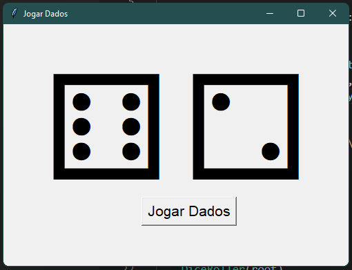

<h2>Jogar Dados</h2>

Apresento meu projeto de Jogo de Dados desenvolvido em <string>Python</string> com <string>Tkinter</string>! Divirta-se com este jogo simples, onde você pode lançar dados virtualmente. Utilizando a biblioteca <string>Tkinter</string>, criei uma interface gráfica amigável e interativa. Experimente sua sorte e desfrute da emoção de lançar dados a qualquer momento. Este projeto é uma demonstração do meu interesse em desenvolvimento em <string>Python</string> e minha capacidade de criar aplicações.

